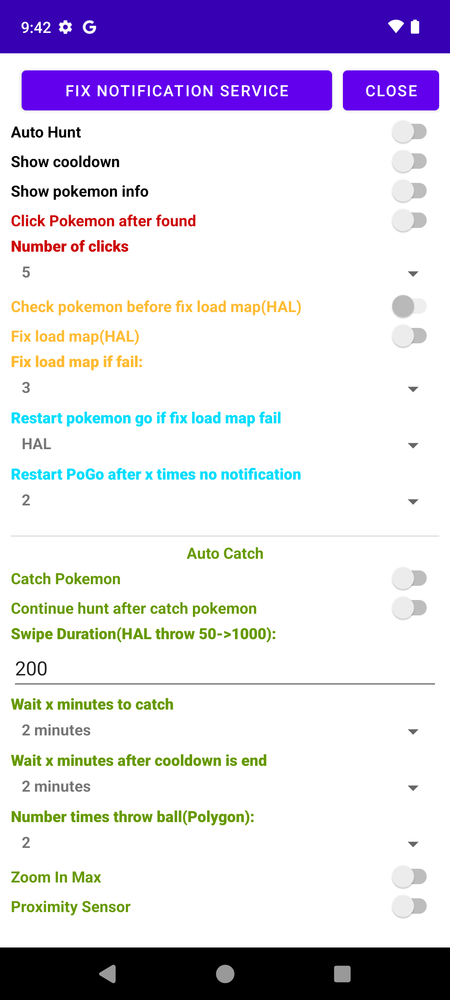
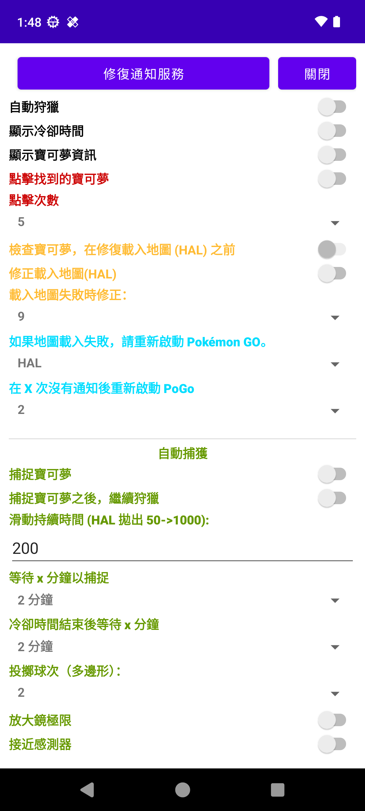

# Xposed Translate Text

**Auto-translate app text using [Free Google API](https://github.com/ssut/py-googletrans/issues/268)**

## 📥 Download

[⬇️ **Download the Latest APK**](https://github.com/tianci-sh/XPTranslateText/actions/workflows/build.yml)
> Select the latest successful workflow run and download the APK from the **Artifacts** section.

## 📦 **Installation & Setup**

### Requirements
- [LSPosed](https://github.com/LSPosed/LSPosed) or another **Xposed Framework** variant must be
  installed and enabled.

### Installation Steps

1. Install the downloaded APK from the link above.
2. Open the **LSPosed Manager app**, navigate to **Modules**, and enable **XPTranslateText**.
3. Select the apps you want to translate from the module settings in LSPosed.
4. Kill your app and restart it.

After restart, the selected apps should display translated text automatically.

## ✅ **Compatibility**
- Tested and confirmed working on:
    - Android 13 with LSPosed
    - Android 15 with LSPosed

## 🖼️ **Before & After Comparison**

| Before                                    | After                                    |
|-------------------------------------------|------------------------------------------|
|  |  |

## 📁 **Project Structure**

```text
XPTranslateText/
├── app/
│   ├── key.jks            # Generated by GitHub Actions
│   └── build.gradle
├── gradlew
├── gradlew.bat
├── keystore.properties     # Local-only, not committed
└── settings.gradle
```